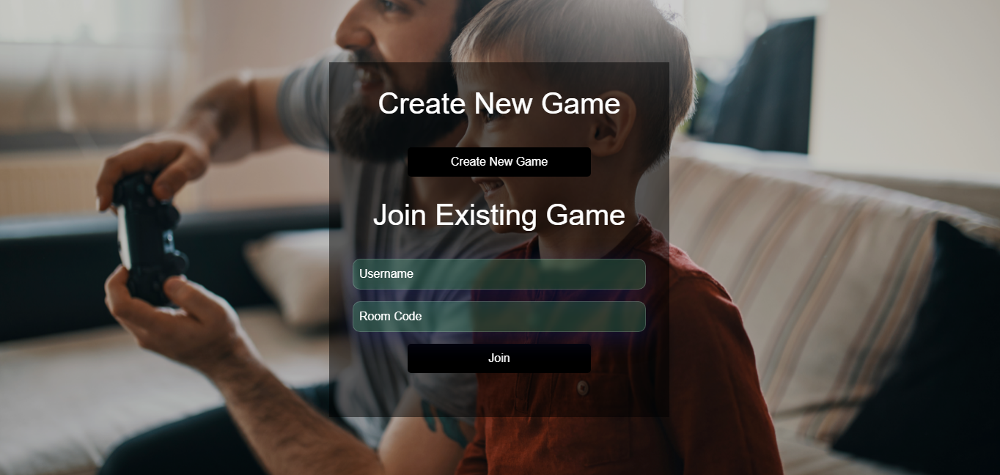
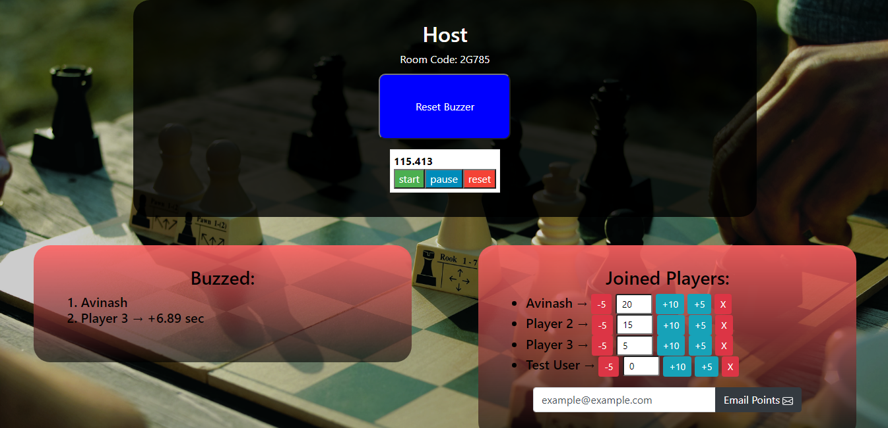

<h1 align="center">Buzzer</h1>

<p align="center">
  
</p>
<p align="center">

</p>
<p>
<h4 align="center"> For Live Demo Visit : https://buzzthebuzzer.herokuapp.com/
</h4>
</p>

Description
---------------------


This is a Django ASGI based buzzer Application for playing games.

Users can use this buzzer app for playing other games on Screen Sharing. Multiple players can join one room. The host has the option to add, deduct points, reset the buzzer, kick out a player from room and mail the points to an email id. `mail feature has been disabled now due to security concerns`

<h4>HOST VIEW : </h4>

<p align="center">

</p>
<h4>PLAYER VIEW : </h4>
<p align="center">

</p>


I developed it keeping in mind the remote working situation due to widespread pandamic.


Running on local machine
---------------------
1. Clone this project<br>
  ```
  $ git clone https://github.com/avina5hkr/buzzer.git
  ```  
2. Create and activate a virtual environment (optional) <br>
  ```bash python
  $ python venv venv
  $ source venv/bin/activate
  ```
3. Install the python dependencies
  ```python
  $ pip install -r requirements.txt
  ```
4. Run the development server
  ```python
  $ python manage.py runerver 0.0.0.0:8000
  ```


